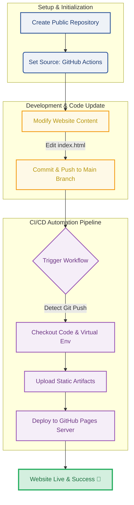

# 🚀 Automated Generative AI Curriculum Website

This repository hosts a responsive, highly structural curriculum website for the **Generative AI Course (Chapters 1–12)**. Built with Bootstrap 5 and deployed automatically via modern Cloud CI/CD practices.

📌 **Live Website URL:** [https://github.io](https://github.io)

---

## 🎨 System Architecture & CI/CD Workflow

The website utilizes a fully automated, **zero-cost serverless architecture**. Every time a code update is pushed, GitHub Actions instantly handles the pipeline and safely deploys the content to GitHub Pages.



### ⚙️ Workflow Phase Breakdown

#### 1. Setup & Initialization Phase (初始化配置)
* **Public Repository:** The project repository must remain **Public** to leverage the free tier of GitHub Pages.
* **Actions Publishing Source:** The deployment engine bypasses legacy branch workflows and uses direct **GitHub Actions OIDC** runner integration for better security and speed.

#### 2. Development & Code Update Phase (開發與上傳)
* **Code Maintenance:** Web assets (e.g., `index.html`, CSS, JS) are kept neatly in the root directory.
* **Instant Triggers:** Committing updates via Git or the web UI immediately dispatches a webhook to the automation runner.

#### 3. Continuous Integration & Deployment Phase (CI/CD 自動化加速)
* **Virtual Runner:** An ephemeral Linux environment (`ubuntu-latest`) spins up on demand.
* **Artifact Bundling:** The system checks out the latest code version, verifies structural validity, and packages it using `actions/upload-pages-artifact`.
* **Secured Delivery:** The bundled artifact is directly pushed into the edge nodes of GitHub's hosting cluster via `actions/deploy-pages`.

#### 4. Live Production Phase (網站正式發布)
* **Zero-Downtime Swap:** Old cache assets are safely swapped behind the scenes without breaking current sessions.
* **Global Access:** The website updates live globally across the content delivery network under your personal namespace.

---

## 📁 Repository Structure
```text
.
├── .github/
│   └── workflows/
│       └── static.yml     # The core CI/CD automation workflow file
├── index.html             # Main responsive curriculum syllabus homepage
└── README.md              # Documentation (This file)
```

---

## 🛠 Tech Stack Built-In
* **Hosting Platform:** GitHub Pages (100% Free Resources)
* **Automation Automation:** GitHub Actions CI/CD Pipeline
* **Frontend UI Framework:** HTML5, CSS3, Bootstrap 5 (Responsive Layout)
* **Icons Pack:** Bootstrap Icons
